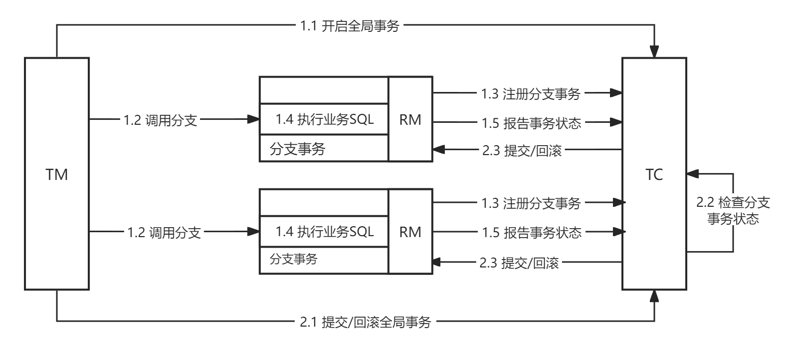

# Seata-XA 模式详解
## 前提
- 支持 XA 协议的数据库，比如 MySQL。
- 支持 XA 协议的数据源，比如 JDBC。

## 原理
XA 是一种分布式事务协议，用于在分布式环境下实现事务的一致性。它通过将本地事务（Local Transaction）与全局事务（Global Transaction）进行协调来实现分布式事务。

XA 模式使用了一组标准的 API，通常包括两个阶段：事务准备（Prepare）和事务提交（Commit）。

### 执行流程
第一阶段：
1. 注册全局事务
2. 调用 RM 事务接口，注册分支事务
3. 执行 RM 事务操作，不提交
4. 往 TC 报告事务状态

第二阶段：
1. 所有 RM 执行完本地事务，TM 发起全局事务提交/回滚
2. TC 检查所有 RM 事务状态，yes or no?
   - yes，通知所有 RM 提交事务
   - no，通知所有 RM 回滚事务

## 优缺点
### 优点
- 事务强一致性，满足 ACID 原则。
- 常用的数据库都支持，实现简单，并且没有代码侵入。

### 缺点
- 第一阶段锁定数据库资源，等待二阶段结束才释放，锁定资源过长，性能较差。
- 依赖关系型数据库的实现事务。
  