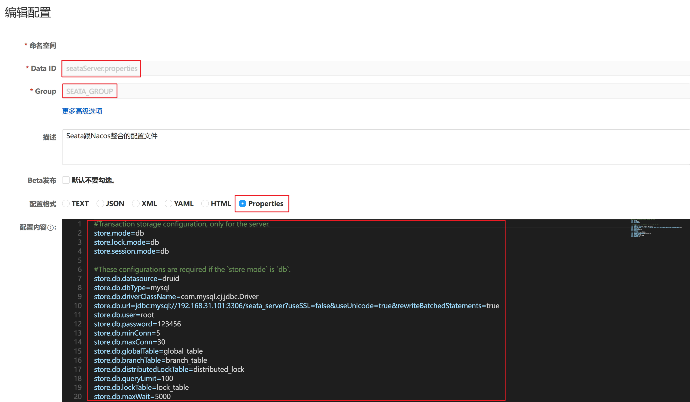

# Seata 与 Nacos 的整合配置
## 1.配置步骤



## 2.配置文件
```properties
#Transaction storage configuration, only for the server.
store.mode=db
store.lock.mode=db
store.session.mode=db

#These configurations are required if the `store mode` is `db`.
store.db.datasource=druid
store.db.dbType=mysql
store.db.driverClassName=com.mysql.cj.jdbc.Driver
store.db.url=jdbc:mysql://192.168.31.101:3306/seata_server?useSSL=false&useUnicode=true&rewriteBatchedStatements=true
store.db.user=root
store.db.password=123456
store.db.minConn=5
store.db.maxConn=30
store.db.globalTable=global_table
store.db.branchTable=branch_table
store.db.distributedLockTable=distributed_lock
store.db.queryLimit=100
store.db.lockTable=lock_table
store.db.maxWait=5000
```

## 3.查看效果
