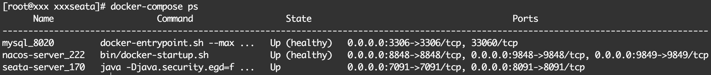
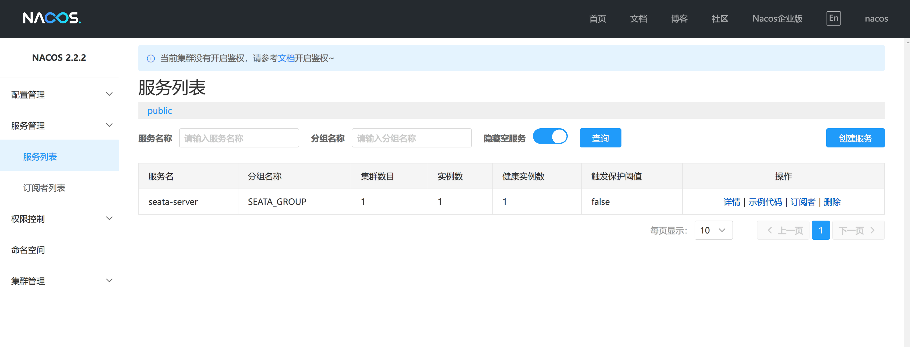
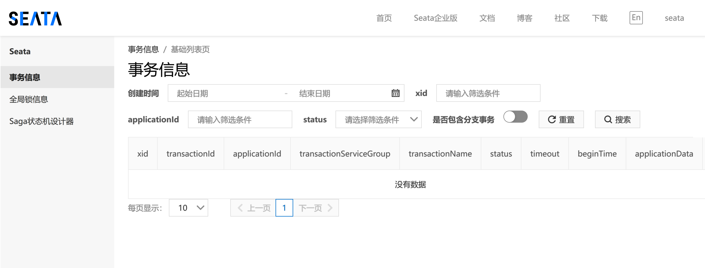
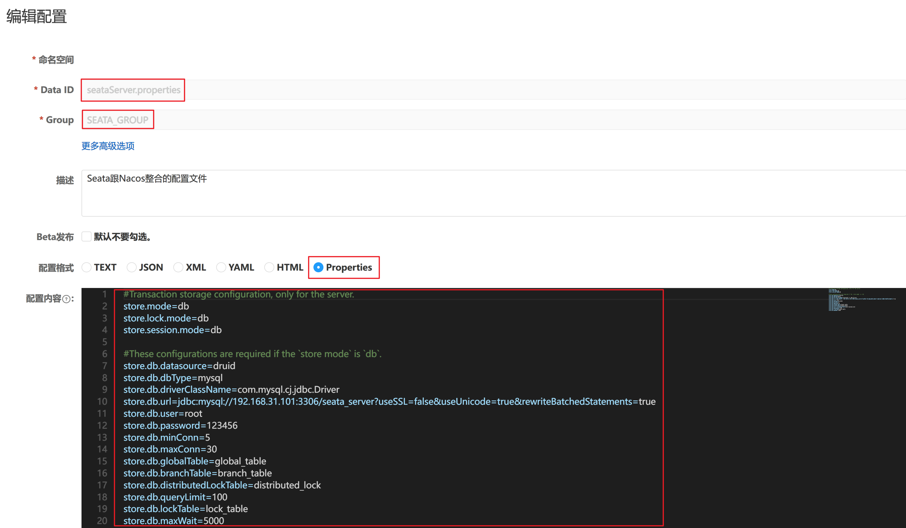
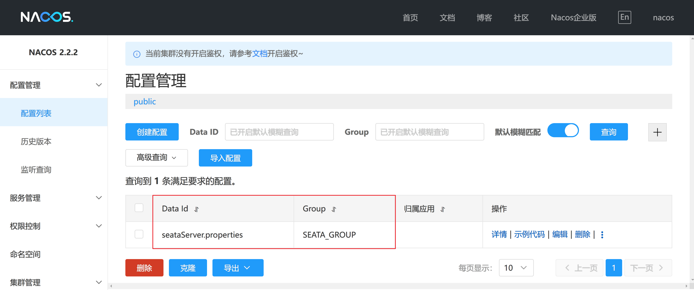

# 工程环境的搭建与配置
## 1.版本说明
| 中间件   | 版本       |
|-------|----------|
| MySQL | 8.0.28   |
| Nacos | 2.2.2    |
| Seata | 1.7.0    |
| docker | 20.10.18 |
| docker-compose | 1.29.2   |
> - 系统版本：CentOs 7.9
> - 机器 IP：192.168.31.101

## 2.目录结构
- **env**
```shell
├── docker-compose.yml
├── mysql8
│   └── init
│       └── init.sql
└── seata
    └── resources
        └── application.yml
```

## 3.文件内容
### 3.1 **env/docker-compose.yml**
```yaml
version: '3.9'
services:
  mysql8:
    image: mysql:8.0.20
    container_name: mysql_8020
    restart: unless-stopped
    security_opt:
      - seccomp:unconfined
    environment:
      TZ: Asia/Shanghai
      MYSQL_ROOT_PASSWORD: 123456
      LANG: en_US.UTF-8
    ports:
      - "3306:3306"
    command:
      --max_connections=1000
      --character-set-server=utf8mb4
      --collation-server=utf8mb4_general_ci
      --default-authentication-plugin=mysql_native_password
      --sql-mode="STRICT_TRANS_TABLES,NO_ENGINE_SUBSTITUTION,NO_ZERO_DATE,NO_ZERO_IN_DATE,ERROR_FOR_DIVISION_BY_ZERO"
    volumes:
      - "./mysql/data:/var/lib/mysql"
      - "./mysql/conf:/etc/mysql"
      - "./mysql/mysql-files:/var/lib/mysql-files"
      - "./mysql/init:/docker-entrypoint-initdb.d/"
    networks:
      - custom_net
    healthcheck:
      test: [ "CMD", "mysqladmin" ,"ping", "-h", "localhost" ]
      retries: 10

  nacos:
    image: nacos/nacos-server:v2.2.2
    container_name: nacos-server_222
    restart: unless-stopped
    volumes:
      - "./nacos/logs:/home/nacos/logs"
      - "./nacos/data/:/home/nacos/data"
    environment:
      - MODE=standalone
      - SPRING_DATASOURCE_PLATFORM=mysql
      # 修改MySQL的连接信息
      - MYSQL_SERVICE_HOST=192.168.31.101
      - MYSQL_SERVICE_DB_NAME=nacos_config
      - MYSQL_SERVICE_PORT=3306
      - MYSQL_SERVICE_USER=root
      - MYSQL_SERVICE_PASSWORD=123456
      # 调整Nacos的JVM参数
      - JVM_XMS=256m
      - JVM_XMX=256m
      - JVM_XMN=128m
      - JVM_MS=64m
      - JVM_MMS=64m
      - MYSQL_SERVICE_DB_PARAM=characterEncoding=utf8&connectTimeout=10000&socketTimeout=30000&autoReconnect=true&useSSL=false&serverTimezone=UTC
    ports:
      - "8848:8848"
      - "9848:9848"
      - "9849:9849"
    networks:
      - custom_net
    healthcheck:
      test: ["CMD-SHELL", "echo 'ruok' | curl -s telnet://localhost:8848 || exit 1"]
      retries: 10
    depends_on:
      mysql8:
        condition: service_healthy

  seata:
    image: seataio/seata-server:1.7.0
    container_name: seata-server_170
    restart: unless-stopped
    volumes:
      - "./seata/resources/application.yml:/seata-server/resources/application.yml"
    environment:
      TZ: Asia/Shanghai
      LANG: en_US.UTF-8
      # 注册到Nacos上的IP
      SEATA_IP: 192.168.31.101
      # 注册到Nacos上的端口号
      SEATA_PORT: 8091
    ports:
      - "7091:7091"
      - "8091:8091"
    depends_on:
      nacos:
        condition: service_healthy
    networks:
      - custom_net

networks:
  custom_net:
    external:
      name: play_with_seata_net
```
### 3.2 **env/mysql/init/init.sql**
```mysql
CREATE DATABASE `nacos_config` DEFAULT CHARACTER SET utf8mb4 COLLATE utf8mb4_general_ci;
CREATE DATABASE `seata_server` DEFAULT CHARACTER SET utf8mb4 COLLATE utf8mb4_general_ci;


create user 'nacos'@'%' identified by 'nacos';
grant all privileges on nacos_config.* to 'nacos'@'%' with grant option;
create user 'seata'@'%' identified by 'seata';
grant all privileges on seata_server.* to 'seata'@'%' with grant option;
flush privileges;


use nacos_config;

/*
 * Copyright 1999-2018 Alibaba Group Holding Ltd.
 *
 * Licensed under the Apache License, Version 2.0 (the "License");
 * you may not use this file except in compliance with the License.
 * You may obtain a copy of the License at
 *
 *      http://www.apache.org/licenses/LICENSE-2.0
 *
 * Unless required by applicable law or agreed to in writing, software
 * distributed under the License is distributed on an "AS IS" BASIS,
 * WITHOUT WARRANTIES OR CONDITIONS OF ANY KIND, either express or implied.
 * See the License for the specific language governing permissions and
 * limitations under the License.
 */

/******************************************/
/*   数据库全名 = nacos_config   */
/*   表名称 = config_info   */
/******************************************/
CREATE TABLE `config_info` (
    `id` bigint(20) NOT NULL AUTO_INCREMENT COMMENT 'id',
    `data_id` varchar(255) NOT NULL COMMENT 'data_id',
    `group_id` varchar(128) DEFAULT NULL,
    `content` longtext NOT NULL COMMENT 'content',
    `md5` varchar(32) DEFAULT NULL COMMENT 'md5',
    `gmt_create` datetime NOT NULL DEFAULT CURRENT_TIMESTAMP COMMENT '创建时间',
    `gmt_modified` datetime NOT NULL DEFAULT CURRENT_TIMESTAMP COMMENT '修改时间',
    `src_user` text COMMENT 'source user',
    `src_ip` varchar(50) DEFAULT NULL COMMENT 'source ip',
    `app_name` varchar(128) DEFAULT NULL,
    `tenant_id` varchar(128) DEFAULT '' COMMENT '租户字段',
    `c_desc` varchar(256) DEFAULT NULL,
    `c_use` varchar(64) DEFAULT NULL,
    `effect` varchar(64) DEFAULT NULL,
    `type` varchar(64) DEFAULT NULL,
    `c_schema` text,
    `encrypted_data_key` text NOT NULL COMMENT '秘钥',
    PRIMARY KEY (`id`),
    UNIQUE KEY `uk_configinfo_datagrouptenant` (`data_id`,`group_id`,`tenant_id`)
) ENGINE=InnoDB DEFAULT CHARSET=utf8 COLLATE=utf8_bin COMMENT='config_info';

/******************************************/
/*   数据库全名 = nacos_config   */
/*   表名称 = config_info_aggr   */
/******************************************/
CREATE TABLE `config_info_aggr` (
    `id` bigint(20) NOT NULL AUTO_INCREMENT COMMENT 'id',
    `data_id` varchar(255) NOT NULL COMMENT 'data_id',
    `group_id` varchar(128) NOT NULL COMMENT 'group_id',
    `datum_id` varchar(255) NOT NULL COMMENT 'datum_id',
    `content` longtext NOT NULL COMMENT '内容',
    `gmt_modified` datetime NOT NULL COMMENT '修改时间',
    `app_name` varchar(128) DEFAULT NULL,
    `tenant_id` varchar(128) DEFAULT '' COMMENT '租户字段',
    PRIMARY KEY (`id`),
    UNIQUE KEY `uk_configinfoaggr_datagrouptenantdatum` (`data_id`,`group_id`,`tenant_id`,`datum_id`)
) ENGINE=InnoDB DEFAULT CHARSET=utf8 COLLATE=utf8_bin COMMENT='增加租户字段';

/******************************************/
/*   数据库全名 = nacos_config   */
/*   表名称 = config_info_beta   */
/******************************************/
CREATE TABLE `config_info_beta` (
    `id` bigint(20) NOT NULL AUTO_INCREMENT COMMENT 'id',
    `data_id` varchar(255) NOT NULL COMMENT 'data_id',
    `group_id` varchar(128) NOT NULL COMMENT 'group_id',
    `app_name` varchar(128) DEFAULT NULL COMMENT 'app_name',
    `content` longtext NOT NULL COMMENT 'content',
    `beta_ips` varchar(1024) DEFAULT NULL COMMENT 'betaIps',
    `md5` varchar(32) DEFAULT NULL COMMENT 'md5',
    `gmt_create` datetime NOT NULL DEFAULT CURRENT_TIMESTAMP COMMENT '创建时间',
    `gmt_modified` datetime NOT NULL DEFAULT CURRENT_TIMESTAMP COMMENT '修改时间',
    `src_user` text COMMENT 'source user',
    `src_ip` varchar(50) DEFAULT NULL COMMENT 'source ip',
    `tenant_id` varchar(128) DEFAULT '' COMMENT '租户字段',
    `encrypted_data_key` text NOT NULL COMMENT '秘钥',
    PRIMARY KEY (`id`),
    UNIQUE KEY `uk_configinfobeta_datagrouptenant` (`data_id`,`group_id`,`tenant_id`)
) ENGINE=InnoDB DEFAULT CHARSET=utf8 COLLATE=utf8_bin COMMENT='config_info_beta';

/******************************************/
/*   数据库全名 = nacos_config   */
/*   表名称 = config_info_tag   */
/******************************************/
CREATE TABLE `config_info_tag` (
    `id` bigint(20) NOT NULL AUTO_INCREMENT COMMENT 'id',
    `data_id` varchar(255) NOT NULL COMMENT 'data_id',
    `group_id` varchar(128) NOT NULL COMMENT 'group_id',
    `tenant_id` varchar(128) DEFAULT '' COMMENT 'tenant_id',
    `tag_id` varchar(128) NOT NULL COMMENT 'tag_id',
    `app_name` varchar(128) DEFAULT NULL COMMENT 'app_name',
    `content` longtext NOT NULL COMMENT 'content',
    `md5` varchar(32) DEFAULT NULL COMMENT 'md5',
    `gmt_create` datetime NOT NULL DEFAULT CURRENT_TIMESTAMP COMMENT '创建时间',
    `gmt_modified` datetime NOT NULL DEFAULT CURRENT_TIMESTAMP COMMENT '修改时间',
    `src_user` text COMMENT 'source user',
    `src_ip` varchar(50) DEFAULT NULL COMMENT 'source ip',
    PRIMARY KEY (`id`),
    UNIQUE KEY `uk_configinfotag_datagrouptenanttag` (`data_id`,`group_id`,`tenant_id`,`tag_id`)
) ENGINE=InnoDB DEFAULT CHARSET=utf8 COLLATE=utf8_bin COMMENT='config_info_tag';

/******************************************/
/*   数据库全名 = nacos_config   */
/*   表名称 = config_tags_relation   */
/******************************************/
CREATE TABLE `config_tags_relation` (
    `id` bigint(20) NOT NULL COMMENT 'id',
    `tag_name` varchar(128) NOT NULL COMMENT 'tag_name',
    `tag_type` varchar(64) DEFAULT NULL COMMENT 'tag_type',
    `data_id` varchar(255) NOT NULL COMMENT 'data_id',
    `group_id` varchar(128) NOT NULL COMMENT 'group_id',
    `tenant_id` varchar(128) DEFAULT '' COMMENT 'tenant_id',
    `nid` bigint(20) NOT NULL AUTO_INCREMENT,
    PRIMARY KEY (`nid`),
    UNIQUE KEY `uk_configtagrelation_configidtag` (`id`,`tag_name`,`tag_type`),
    KEY `idx_tenant_id` (`tenant_id`)
) ENGINE=InnoDB DEFAULT CHARSET=utf8 COLLATE=utf8_bin COMMENT='config_tag_relation';

/******************************************/
/*   数据库全名 = nacos_config   */
/*   表名称 = group_capacity   */
/******************************************/
CREATE TABLE `group_capacity` (
    `id` bigint(20) unsigned NOT NULL AUTO_INCREMENT COMMENT '主键ID',
    `group_id` varchar(128) NOT NULL DEFAULT '' COMMENT 'Group ID，空字符表示整个集群',
    `quota` int(10) unsigned NOT NULL DEFAULT '0' COMMENT '配额，0表示使用默认值',
    `usage` int(10) unsigned NOT NULL DEFAULT '0' COMMENT '使用量',
    `max_size` int(10) unsigned NOT NULL DEFAULT '0' COMMENT '单个配置大小上限，单位为字节，0表示使用默认值',
    `max_aggr_count` int(10) unsigned NOT NULL DEFAULT '0' COMMENT '聚合子配置最大个数，，0表示使用默认值',
    `max_aggr_size` int(10) unsigned NOT NULL DEFAULT '0' COMMENT '单个聚合数据的子配置大小上限，单位为字节，0表示使用默认值',
    `max_history_count` int(10) unsigned NOT NULL DEFAULT '0' COMMENT '最大变更历史数量',
    `gmt_create` datetime NOT NULL DEFAULT CURRENT_TIMESTAMP COMMENT '创建时间',
    `gmt_modified` datetime NOT NULL DEFAULT CURRENT_TIMESTAMP COMMENT '修改时间',
    PRIMARY KEY (`id`),
    UNIQUE KEY `uk_group_id` (`group_id`)
) ENGINE=InnoDB DEFAULT CHARSET=utf8 COLLATE=utf8_bin COMMENT='集群、各Group容量信息表';

/******************************************/
/*   数据库全名 = nacos_config   */
/*   表名称 = his_config_info   */
/******************************************/
CREATE TABLE `his_config_info` (
    `id` bigint(20) unsigned NOT NULL,
    `nid` bigint(20) unsigned NOT NULL AUTO_INCREMENT,
    `data_id` varchar(255) NOT NULL,
    `group_id` varchar(128) NOT NULL,
    `app_name` varchar(128) DEFAULT NULL COMMENT 'app_name',
    `content` longtext NOT NULL,
    `md5` varchar(32) DEFAULT NULL,
    `gmt_create` datetime NOT NULL DEFAULT CURRENT_TIMESTAMP,
    `gmt_modified` datetime NOT NULL DEFAULT CURRENT_TIMESTAMP,
    `src_user` text,
    `src_ip` varchar(50) DEFAULT NULL,
    `op_type` char(10) DEFAULT NULL,
    `tenant_id` varchar(128) DEFAULT '' COMMENT '租户字段',
    `encrypted_data_key` text NOT NULL COMMENT '秘钥',
    PRIMARY KEY (`nid`),
    KEY `idx_gmt_create` (`gmt_create`),
    KEY `idx_gmt_modified` (`gmt_modified`),
    KEY `idx_did` (`data_id`)
) ENGINE=InnoDB DEFAULT CHARSET=utf8 COLLATE=utf8_bin COMMENT='多租户改造';

/******************************************/
/*   数据库全名 = nacos_config   */
/*   表名称 = tenant_capacity   */
/******************************************/
CREATE TABLE `tenant_capacity` (
    `id` bigint(20) unsigned NOT NULL AUTO_INCREMENT COMMENT '主键ID',
    `tenant_id` varchar(128) NOT NULL DEFAULT '' COMMENT 'Tenant ID',
    `quota` int(10) unsigned NOT NULL DEFAULT '0' COMMENT '配额，0表示使用默认值',
    `usage` int(10) unsigned NOT NULL DEFAULT '0' COMMENT '使用量',
    `max_size` int(10) unsigned NOT NULL DEFAULT '0' COMMENT '单个配置大小上限，单位为字节，0表示使用默认值',
    `max_aggr_count` int(10) unsigned NOT NULL DEFAULT '0' COMMENT '聚合子配置最大个数',
    `max_aggr_size` int(10) unsigned NOT NULL DEFAULT '0' COMMENT '单个聚合数据的子配置大小上限，单位为字节，0表示使用默认值',
    `max_history_count` int(10) unsigned NOT NULL DEFAULT '0' COMMENT '最大变更历史数量',
    `gmt_create` datetime NOT NULL DEFAULT CURRENT_TIMESTAMP COMMENT '创建时间',
    `gmt_modified` datetime NOT NULL DEFAULT CURRENT_TIMESTAMP COMMENT '修改时间',
    PRIMARY KEY (`id`),
    UNIQUE KEY `uk_tenant_id` (`tenant_id`)
) ENGINE=InnoDB DEFAULT CHARSET=utf8 COLLATE=utf8_bin COMMENT='租户容量信息表';

CREATE TABLE `tenant_info` (
    `id` bigint(20) NOT NULL AUTO_INCREMENT COMMENT 'id',
    `kp` varchar(128) NOT NULL COMMENT 'kp',
    `tenant_id` varchar(128) default '' COMMENT 'tenant_id',
    `tenant_name` varchar(128) default '' COMMENT 'tenant_name',
    `tenant_desc` varchar(256) DEFAULT NULL COMMENT 'tenant_desc',
    `create_source` varchar(32) DEFAULT NULL COMMENT 'create_source',
    `gmt_create` bigint(20) NOT NULL COMMENT '创建时间',
    `gmt_modified` bigint(20) NOT NULL COMMENT '修改时间',
    PRIMARY KEY (`id`),
    UNIQUE KEY `uk_tenant_info_kptenantid` (`kp`,`tenant_id`),
    KEY `idx_tenant_id` (`tenant_id`)
) ENGINE=InnoDB DEFAULT CHARSET=utf8 COLLATE=utf8_bin COMMENT='tenant_info';

CREATE TABLE `users` (
    `username` varchar(50) NOT NULL PRIMARY KEY,
    `password` varchar(500) NOT NULL,
    `enabled` boolean NOT NULL
);

CREATE TABLE `roles` (
    `username` varchar(50) NOT NULL,
    `role` varchar(50) NOT NULL,
    UNIQUE INDEX `idx_user_role` (`username` ASC, `role` ASC) USING BTREE
);

CREATE TABLE `permissions` (
    `role` varchar(50) NOT NULL,
    `resource` varchar(255) NOT NULL,
    `action` varchar(8) NOT NULL,
    UNIQUE INDEX `uk_role_permission` (`role`,`resource`,`action`) USING BTREE
);

INSERT INTO users (username, password, enabled) VALUES ('nacos', '$2a$10$EuWPZHzz32dJN7jexM34MOeYirDdFAZm2kuWj7VEOJhhZkDrxfvUu', TRUE);

INSERT INTO roles (username, role) VALUES ('nacos', 'ROLE_ADMIN');


use seata_server;

-- -------------------------------- The script used when storeMode is 'db' --------------------------------
-- the table to store GlobalSession data
CREATE TABLE IF NOT EXISTS `global_table` (
    `xid`                       VARCHAR(128) NOT NULL,
    `transaction_id`            BIGINT,
    `status`                    TINYINT      NOT NULL,
    `application_id`            VARCHAR(32),
    `transaction_service_group` VARCHAR(32),
    `transaction_name`          VARCHAR(128),
    `timeout`                   INT,
    `begin_time`                BIGINT,
    `application_data`          VARCHAR(2000),
    `gmt_create`                DATETIME,
    `gmt_modified`              DATETIME,
    PRIMARY KEY (`xid`),
    KEY `idx_status_gmt_modified` (`status` , `gmt_modified`),
    KEY `idx_transaction_id` (`transaction_id`)
) ENGINE=InnoDB DEFAULT CHARSET=utf8mb4;

-- the table to store BranchSession data
CREATE TABLE IF NOT EXISTS `branch_table` (
    `branch_id`         BIGINT       NOT NULL,
    `xid`               VARCHAR(128) NOT NULL,
    `transaction_id`    BIGINT,
    `resource_group_id` VARCHAR(32),
    `resource_id`       VARCHAR(256),
    `branch_type`       VARCHAR(8),
    `status`            TINYINT,
    `client_id`         VARCHAR(64),
    `application_data`  VARCHAR(2000),
    `gmt_create`        DATETIME(6),
    `gmt_modified`      DATETIME(6),
    PRIMARY KEY (`branch_id`),
    KEY `idx_xid` (`xid`)
) ENGINE=InnoDB DEFAULT CHARSET=utf8mb4;

-- the table to store lock data
CREATE TABLE IF NOT EXISTS `lock_table` (
    `row_key`        VARCHAR(128) NOT NULL,
    `xid`            VARCHAR(128),
    `transaction_id` BIGINT,
    `branch_id`      BIGINT       NOT NULL,
    `resource_id`    VARCHAR(256),
    `table_name`     VARCHAR(32),
    `pk`             VARCHAR(36),
    `status`         TINYINT      NOT NULL DEFAULT '0' COMMENT '0:locked ,1:rollbacking',
    `gmt_create`     DATETIME,
    `gmt_modified`   DATETIME,
    PRIMARY KEY (`row_key`),
    KEY `idx_status` (`status`),
    KEY `idx_branch_id` (`branch_id`),
    KEY `idx_xid` (`xid`)
) ENGINE=InnoDB DEFAULT CHARSET=utf8mb4;

CREATE TABLE IF NOT EXISTS `distributed_lock` (
    `lock_key`       CHAR(20) NOT NULL,
    `lock_value`     VARCHAR(20) NOT NULL,
    `expire`         BIGINT,
    primary key (`lock_key`)
) ENGINE=InnoDB DEFAULT CHARSET=utf8mb4;

INSERT INTO `distributed_lock` (lock_key, lock_value, expire) VALUES ('AsyncCommitting', ' ', 0);
INSERT INTO `distributed_lock` (lock_key, lock_value, expire) VALUES ('RetryCommitting', ' ', 0);
INSERT INTO `distributed_lock` (lock_key, lock_value, expire) VALUES ('RetryRollbacking', ' ', 0);
INSERT INTO `distributed_lock` (lock_key, lock_value, expire) VALUES ('TxTimeoutCheck', ' ', 0);
```

### 3.3 env/seata/resources/application.yml
```yaml
server:
  port: 7091

spring:
  application:
    name: seata-server

logging:
  config: classpath:logback-spring.xml
  file:
    path: ${user.home}/logs/seata
  extend:
    logstash-appender:
      destination: 127.0.0.1:4560
    kafka-appender:
      bootstrap-servers: 127.0.0.1:9092
      topic: logback_to_logstash

console:
  user:
    username: seata
    password: seata

seata:
  config:
    type: nacos
    nacos:
      # Nacos 地址
      server-addr: 192.168.31.101:8848
      namespace:
      group: SEATA_GROUP
      username:
      password:
      context-path:
      data-id: seataServer.properties
  registry:
    type: nacos
    nacos:
      application: seata-server
      # Nacos 地址
      server-addr: 192.168.31.101:8848
      group: SEATA_GROUP
      namespace:
      cluster: default
      username:
      password:
      context-path:
  security:
    secretKey: SeataSecretKey0c382ef121d778043159209298fd40bf3850a017
    tokenValidityInMilliseconds: 1800000
    ignore:
      urls: /,/**/*.css,/**/*.js,/**/*.html,/**/*.map,/**/*.svg,/**/*.png,/**/*.jpeg,/**/*.ico,/api/v1/auth/login
```

## 4.开始部署
- 创建网卡
```shell
docker network create play_with_seata_net
```
- 启动容器
```shell
docker-compose up -d
```
- 查看容器运行状态
```shell
docker-compose ps
```


## 5.查看效果
### 5.1 Nacos 控制台
- 访问：**192.168.31.101:8848/nacos**


### 5.2 Seata 控制台
- 访问: **192.168.31.101:7091**


## 6.整合配置
### 6.1 配置步骤


### 6.2 配置文件
- **file/seataServer.properties**
```properties
#Transaction storage configuration, only for the server.
store.mode=db
store.lock.mode=db
store.session.mode=db

#These configurations are required if the `store mode` is `db`.
store.db.datasource=druid
store.db.dbType=mysql
store.db.driverClassName=com.mysql.cj.jdbc.Driver
store.db.url=jdbc:mysql://192.168.31.101:3306/seata_server?useSSL=false&useUnicode=true&rewriteBatchedStatements=true
store.db.user=root
store.db.password=123456
store.db.minConn=5
store.db.maxConn=30
store.db.globalTable=global_table
store.db.branchTable=branch_table
store.db.distributedLockTable=distributed_lock
store.db.queryLimit=100
store.db.lockTable=lock_table
store.db.maxWait=5000
```

### 6.3查看效果
